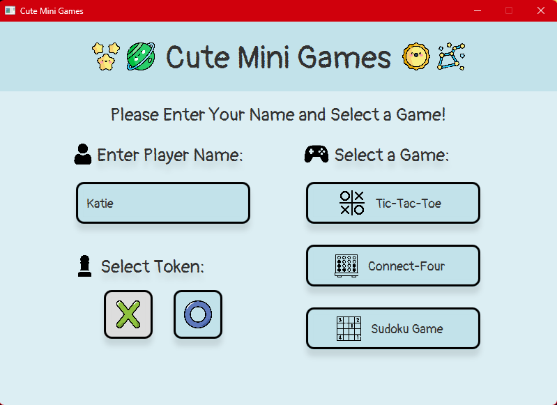
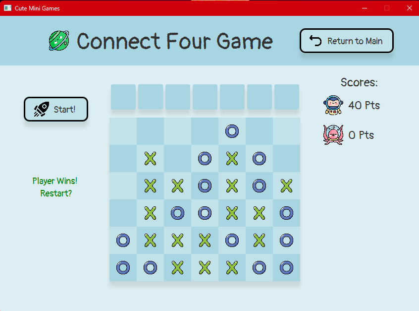
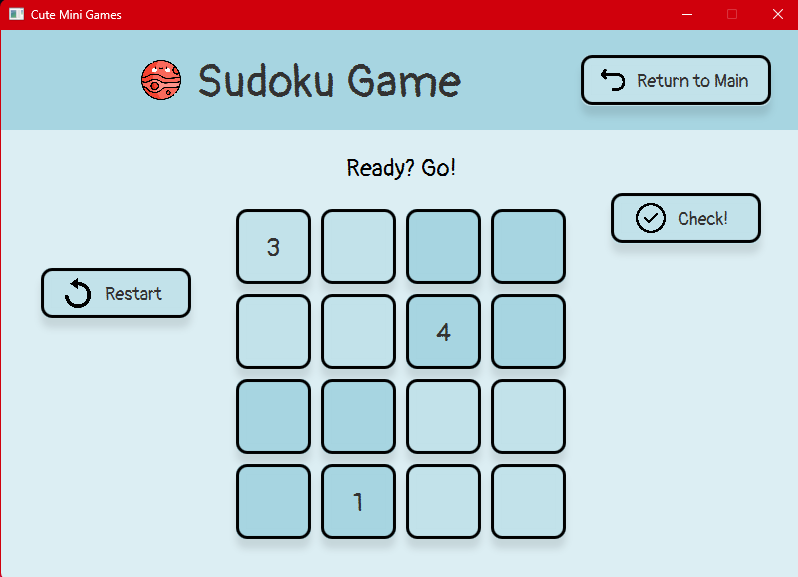
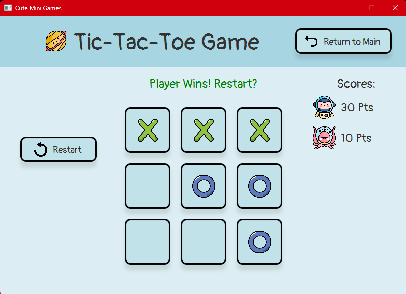

# CuteMiniGames

This Cute Mini Game Application is a fun and entertaining program that offers users the opportunity to play three classic games: Tic Tac Toe, Connect-Four, and Sudoku. Whether you're looking to challenge yourself, this application provides a delightful gaming experience. This application is developed using the Model-View-Controller (MVC) design pattern and built with JavaFX framework, providing a structured and modular approach to software development.

Games:
1. Tic Tac Toe: Engage in the timeless battle of Xs and Os on a 3x3 grid. Take turns with the computer to strategically place your symbols and aim for three in a row to win.
2. Connect-Four: Strategize and outwit the computer in this classic board game. Add your token into the grid and try to form a line of four vertically, horizontally, or diagonally before the computer does.
3. Sudoku: Test your logical thinking and problem-solving skills with various levels of Sudoku puzzles. Fill in the grid 4x4 with numbers, ensuring that each row, column, and 2x2 sub-grid contains all digits without repetition.

Dashboard Frame:

Mini-Games Frame:

